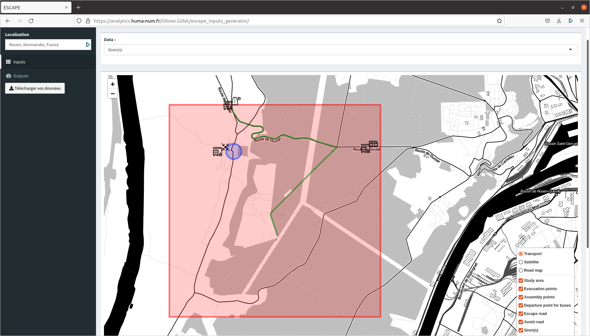

<style>
body {text-align: justify}
</style>

```{r knitr_init, echo=FALSE, message=FALSE, warning=FALSE, cache=FALSE}
library(knitr)
library(rmdformats)
library(kableExtra)
library(ggplot2)
library(dplyr)
library(sf)
library(leaflet)
```


Nous proposons ici un tutoriel pour permettre aux modélisateurs d'utiliser les outils **ESCAPE** via la plateforme de simulation **GAMA** et l'application web "ESCAPE_input_generator". Ce tutoriel est composé de plusieurs étapes (générer les inputs du système, créer l'environnement du système, utiliser des outils **ESCAPE**, réaliser quelques statistiques sur le modèle d'évacuation).

Ce tutoriel présente le développement d'un système simulant de l'évacuation, fictive et peu probable, de la population de la commune du Genétay lors d'un feu de forêt.  

## **Créer un projet GAMA ESCAPE**
### ***Génerer les inputs du modèle ***  
(1) Se rendre sur [l'application web ESCAPE](https://analytics.huma-num.fr/Olivier.Gillet/escape_inputs_generator/)
(2) Télécharger les données d'intérêt pour votre système :  
  - Study area
  - Evacuation points
  - Assembly points
  - Departure point for buses
  - Escape road
  - Avoid road
  - Siren(s)
  - Mobile siren(s)   
 
`r emoji::emoji("warning")` `r emoji::emoji("warning")` `r emoji::emoji("warning")`  Quelques soient les données à télécharger, vous devez créer le shapefile de votre zone d'étude car il est nécessaire pour obtenir l'extension spatiale de la zone d'étude afin de télécharger les données [OpenStreetMap](https://www.openstreetmap.org). Vous pouvez retrouver ces coordonnées (Xmin, Xmax, Ymin, Xmin, EPSG::4326) en bas de la page web après création du polygone de la zone d'étude.  

***  

**Bounding box de notre zone d'étude**   
*Xmin ==> 0.940790176391602*  
*Xmmax ==> 0.996665954589844*  
*Ymin ==> 49.4153288319765*  
*Ymax ==> 49.4536194132892*  

***  

La procédure de création est simple, choisir la donnée dans le menu déroulant, activer le mode édition puis cliquer sur la carte. Les polygones ou les lignes, telles que Escape road ou Study area, nécessitent au minimum deux ou trois points sur la carte. Vous devez valider la géométrie pour générer votre entité.



- Vous pouvez par la suite télécharger vos données. Vous trouverez une archive composée de plusieurs shapefiles *.shp* et d'un  fichier text *.csv* d'organisation des transports en commun. Cette archive est à extraire dans le répertoire *include* `r emoji::emoji("file_folder")` de votre projet GAMA **ESCAPE**.


Pour ce tutoriel, nous avons exporté:  

- *standard_evac_points.shp*, point de fuite des agents véhiculés  
- *sirens-point.shp*, localisation des sirènes fixes  
- *shelter.shp*, fichier avec les points de rassemblement et les abris  
- *roads_evac.shp*, itinéraire d'évacuation  
- *evac_bus_stop.shp*, localisation des arrêts de bus  
- *evac_area.shp*, zone d'étude  
- *evacuation_bus_file_map.csv*, fichier pour la gestion des norias  

### ***Créer l'environnement du système ***  

- Ensuite, vous devez vous rendre sur le site web d'OpenStreetMap [OpenStreetMap](https://www.openstreetmap.org)  
- Renseigner les coordonnées obtenues précédemment (Xmin, Xmax, Ymin, Xmin, EPSG::4326) et télécharger les données [OpenStreetMap](https://www.openstreetmap.org) (routes et bâtiments).Vous obtenez un fichier au format .osm et est à utiliser via les outils **ESCAPE** pour générer l'environnement.
- Les données téléchargées, [OpenStreetMap](https://www.openstreetmap.org) comme pour les données **ESCAPE**, sont à extraire dans le répertoire *include* `r emoji::emoji("file_folder")` de votre projet GAMA **ESCAPE**.

  
Au total, vous devez créer trois fichiers *.gaml* pour exécuter votre modèle dont deux pour créer l'environnement d’exécution du système:  (1) Le premier script *.gaml*  a pour objectif de créer votre environnement à partir du *xml* d'[OpenStreetMap](https://www.openstreetmap.org). (2) Le second script obligatoire sert à calculer la calculer la matrice des plus courts chemins. (3) Le troisième script  est le script principal de votre modèle d'évacuation. La définition et l’exécution du modèle se fait dans ce troisième script.

`r emoji::emoji("mega")`Vous trouverez davantage d'informations sur la page web dédiée à l'import des données OSM sur le de [*GAMA*](https://gama-platform.org/wiki/ManipulateOSMDatas)

  

### ***Exécuter le modèle ***  

 

## **Explorer les sorties du modèle**
### ***Importer les résultats dans l'application***   
Vous devez uploader dans l'onglet *output* les divers shapefiles :  


- car_evacuation_time.shp
- people_evacuation_time.shp
- roads_traffic.shp

`r emoji::emoji("warning")` Il n'est pas nécessaire d'archiver les données avant l'upload.
Vous pouvez télécharger les résultats pour ce modèle d'évacuation à l'adresse suivante :


 