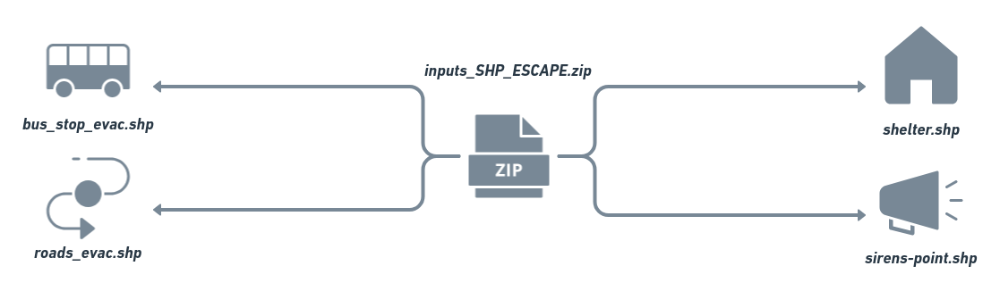
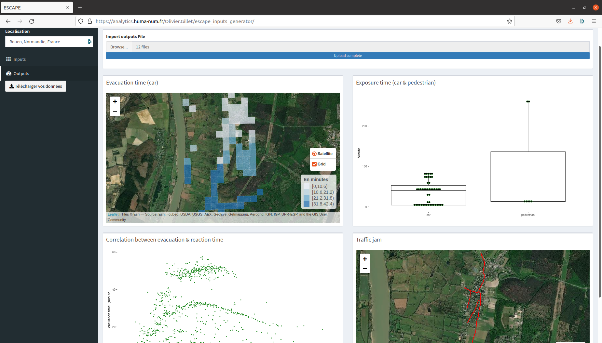

<style>
body {text-align: justify}
</style>

```{r knitr_init, echo=FALSE, message=FALSE, warning=FALSE, cache=FALSE}
library(knitr)
library(rmdformats)
library(kableExtra)
library(ggplot2)
library(leaflet)
```


Nous proposons ici un tutoriel pour permettre aux modélisateurs d'utiliser les outils **ESCAPE** via la plateforme de simulation **ESCAPE** et l'application web "ESCAPE_input_generator". Ce tutoriel est composé de plusieurs étapes (générer les inputs du système, créer l'environnement du système, utiliser des outils **ESCAPE**, réaliser quelques statistiques sur le modèle d'évacuation).

Ce tutoriel présente donc le développement d'un système simulation (fictif et peu probable) de l'évacuation de la population d'une commune du Genétay lors d'un feuu de forêt.  

### ***Génerer les inputs du modèle ***  
- Se rendre sur [l'application web ESCAPE](https://analytics.huma-num.fr/Olivier.Gillet/escape_inputs_generator/)
- Télécharger les données d'intérêt pour votre système (shelter, itinéraire d'évacuation, point de fuite des agents)   
`r emo::ji("warning")` `r emo::ji("warning")` `r emo::ji("warning")`  Quelques soient les données à télécharger, vous de le shapefile de votre zone d'étude. Il est nécessaire d'obtenir l'extension spatiale de la zone d'étude pour télécharger les données [OpenStreetMap](https://www.openstreetmap.org). Vous pouvez retrouver ces coordonnées (Xmin, Xmax, Ymin, Xmin, EPSG::4326) en bas de la page web après création du polygone de la zone d'étude.  


- Vous pouvez par la suite télécharger vos données. Vous trouverez une archive composée de plusieurs shapefiles et d'un csv d'organisation des transports en commun.



### ***Créer l'environnement du système ***  

- Ensuite, vous devez vous rendre sur le site web d'OpenStreetMap [OpenStreetMap](https://www.openstreetmap.org)  
- Renseigner les coordonnées obtenues précédemment (Xmin, Xmax, Ymin, Xmin, EPSG::4326) et télécharger les données [OpenStreetMap](https://www.openstreetmap.org) (routes et bâtiments).Vous obtenez un fichier au format .osm à utiliser via les outils **ESCAPE** pour générer l'environnement.
- Les données téléchargées, [OpenStreetMap](https://www.openstreetmap.org) comme les données **ESCAPE** sont à extraire dans le répertoire *include* `r emo::ji("file_folder")`  de votre projet **ESCAPE**.

  

Au total, vous devez créer trois fichiers *.gaml* pour exécuter votre modèle dont deux pour créer l'environnement d'éxecution du système.  
1 - Un fichier pour créer votre environnement à partir du *xml* d'[OpenStreetMap](https://www.openstreetmap.org)   
2 - Un fichier pour calculer la matrice des plus courts chemins  
3 - Un fichier contenant le script principal du modèle d'évacuation   

### ***Importer les résultats dans l'application***   
Vous devez uploader dans l'onglet *output* le fichier *oputs_SHP_ESCAPE.txt* créer par le script **GAMA**.  
 